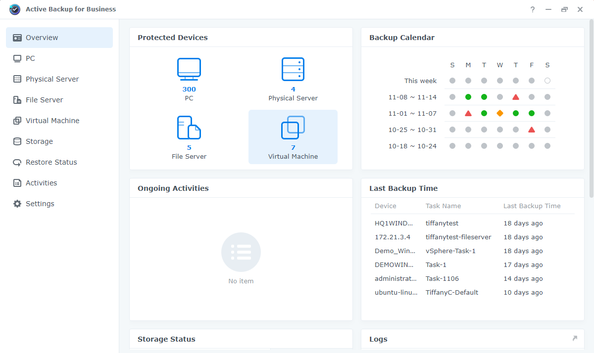

# Synology Active Backup

## Overview


**Dev Insight:** This script can also be used to update or reconfigure the Synology Active Backup for business agent.


The software applications available for Synology devices can be pretty powerful. One of my favorites, especially for internal IT, is Active Backup for Business (ABB).

<figure><figcaption></figcaption></figure>

**From their** [**Administrator's Guide**](https://global.synologydownload.com/download/Document/Software/AdminGuide/Package/ActiveBackup/All/enu/Synology\_ABB\_admin\_guide\_Windows\_PC\_PS\_enu.pdf)**:**

> ABB centralizes data protection across a variety of IT environments, including virtual machines, physical servers, file servers, and personal computers. Administrators can deploy their preferred protection plan single-handedly through ABB's centralized admin console.&#x20;
>
> ABB also offers a wide range of backup options and restoration tools, as well as a number of optional technical and safety features.



This script eases the deployment of the backup agent for Windows devices by silently downloading, installing, and configuring the agent on a device.

**Prerequisites:**

1. Setup Active Backup for Business on your Synology NAS.
2. Create a user account to authenticate the agent.
3. Configure your default backup tasks.

***

## Script



## Examples

### Example 1

```powershell
.\InstallSynologyActiveBackup.ps1 -Address "localhost" -Username "Backups" -Pass "Da ba dee da ba di"
```

This example downloads, installs, and configures the latest version of Synology Active Backup for Business agent.&#x20;


***

## Parameters

### Required Parameters

`-Address`

**Aliases:** `-Host`, `-Hostname`, `-IP`

The hostname or IP address of the Synology Active Backup for Business server.


`-Username`

**Aliases:** `-User`

The username used to authenticate with the Synology Active Backup for Business server.


`-Pass`

**Aliases:** `-Password`

The password used to authenticate with the Synology Active Backup for Business server.

